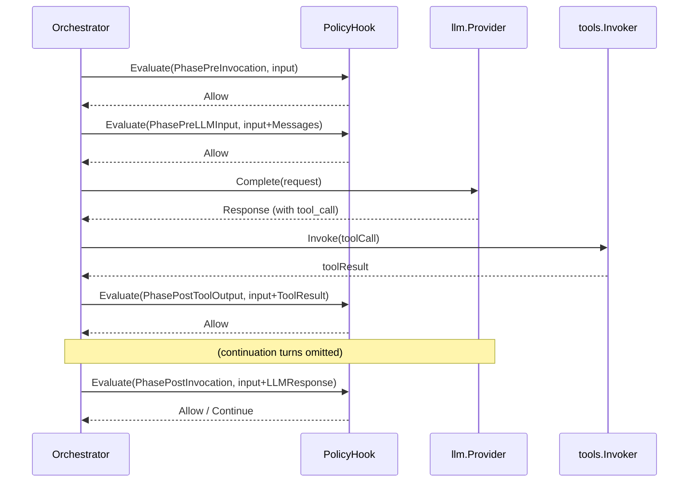

# hooks Package

## Purpose

The `hooks` package defines the policy engine and content filter interfaces that enforce organizational governance across the invocation lifecycle. It covers two orthogonal concerns:

- **Policy evaluation** (`PolicyHook`) — coarse-grained `Allow`/`Deny`/`RequireApproval`/`Log`/`Continue` decisions at four lifecycle phases.
- **Content filtering** (`PreLLMFilter`, `PreToolFilter`, `PostToolFilter`) — fine-grained inspection and per-field redaction of data flowing through the three data-flow seams.

All hook and filter interfaces are **frozen at v1.0** and safe for concurrent use. The framework ships `AllowAllPolicyHook` as the default policy, which permits everything.

## Key Interfaces and Types

| Name | Kind | Description |
|---|---|---|
| `PolicyHook` | Interface | Single method `Evaluate` called at each of the four lifecycle phases. |
| `Phase` | Enum (string) | Lifecycle checkpoint. Four values: `PhasePreInvocation`, `PhasePreLLMInput`, `PhasePostToolOutput`, `PhasePostInvocation`. |
| `PolicyInput` | Struct | Carries invocation state to `Evaluate`. Same struct across all phases; certain fields are only populated at certain phases. |
| `Decision` | Struct | Policy verdict with metadata and reason. Five verdict values. |
| `Verdict` | Enum (string) | Policy outcome: `VerdictAllow`, `VerdictDeny`, `VerdictRequireApproval`, `VerdictLog`, `VerdictContinue`. |
| `PreLLMFilter` | Interface | Inspects or mutates messages before they reach the LLM provider. |
| `PreToolFilter` | Interface | Inspects, mutates, or blocks a `tools.ToolCall` before it is dispatched. |
| `PostToolFilter` | Interface | Inspects or mutates a `tools.ToolResult` before it is returned to the LLM. |
| `FilterDecision` | Struct | Per-field action record. Returned as a slice from each filter call. |
| `FilterAction` | Enum (string) | Filter outcome: `FilterActionPass`, `FilterActionRedact`, `FilterActionLog`, `FilterActionBlock`. |
| `AllowAllPolicyHook` | Struct | Default policy hook that returns `Allow` for every phase. |

:::note Helper constructors
Decisions are usually built with helpers rather than struct literals: `hooks.Allow()`, `hooks.Deny(reason)`, `hooks.RequireApproval(reason, metadata)`, `hooks.Log(reason)`, `hooks.Continue(reason)`.
:::

## Struct Field Reference

### PolicyInput

Populated by the orchestrator before each `Evaluate` call. Phase-conditional fields are `nil` or empty outside their populating phase.

| Field | Type | Description |
|---|---|---|
| `InvocationID` | `string` | Unique identifier for the current invocation. |
| `Model` | `string` | LLM model identifier in use. |
| `SystemPrompt` | `string` | System prompt, if any. |
| `Messages` | `[]llm.Message` | Conversation history at the time of evaluation. Empty at `PhasePreInvocation` (no turns yet). |
| `ToolResult` | `*tools.ToolResult` | Most recent tool result. **Non-nil only at `PhasePostToolOutput`.** |
| `LLMResponse` | `*llm.LLMResponse` | Final LLM response. **Non-nil only at `PhasePostInvocation`.** |
| `Metadata` | `map[string]string` | Caller-supplied key-value pairs propagated from the `InvocationRequest`. |

### Decision

| Field | Type | Description |
|---|---|---|
| `Verdict` | `Verdict` | Policy outcome (see Verdict values below). |
| `Metadata` | `map[string]any` | Arbitrary data forwarded to telemetry and the `ApprovalSnapshot` for `RequireApproval`. |
| `Reason` | `string` | Human-readable explanation. Required for `Deny` and `RequireApproval`. |

### FilterDecision

Filters return a **slice** of `FilterDecision` values — one per field touched. An empty slice means "nothing changed."

| Field | Type | Description |
|---|---|---|
| `Action` | `FilterAction` | What the filter did (`Pass`, `Redact`, `Log`, `Block`). |
| `Field` | `string` | Which field was affected, using dotted path notation (e.g., `messages[2].text`, `tool_call.arguments`). |
| `Reason` | `string` | Human-readable explanation. Required for `FilterActionBlock`. |

## Policy Engine

The policy engine invokes `PolicyHook.Evaluate` at four lifecycle phases. The **same struct** (`PolicyInput`) is passed at every phase; which of its fields are populated depends on the phase.

### Phase Reference

| Phase | When | Populated `PolicyInput` fields | Typical use |
|---|---|---|---|
| `PhasePreInvocation` | Before the first LLM call | `InvocationID`, `Model`, `SystemPrompt`, `Metadata` (no `Messages` yet) | Authorization, rate limiting, tenant allow-lists |
| `PhasePreLLMInput` | Before each LLM call (including continuations) | Above + `Messages` (full history) | Prompt inspection, per-turn validation |
| `PhasePostToolOutput` | After each tool result is collected | Above + `ToolResult` (non-nil) | Tool-result audit, per-call denial |
| `PhasePostInvocation` | After invocation reaches a terminal state | Above + `LLMResponse` (non-nil) | Audit logging, cost alerting, `Continue` to force another LLM turn |

### Verdict Reference

| Verdict | Effect | State-machine impact |
|---|---|---|
| `VerdictAllow` | Continue normally | No impact |
| `VerdictDeny` | Halt invocation with `PolicyDeniedError` | Transitions to `Failed` terminal state. `Reason` required. |
| `VerdictRequireApproval` | Suspend invocation pending external approval | Transitions to `ApprovalRequired` terminal state. `Metadata` becomes the resumption packet. |
| `VerdictLog` | Continue, but emit a telemetry event recording the decision | No impact; audit trail only |
| `VerdictContinue` | At `PhasePostInvocation`: force one more LLM turn instead of terminating. At other phases: behaves like `Allow`. | Overrides terminal transition at `PhasePostInvocation` |

### Evaluation Flow



### Minimal Policy Example

```go title="examples/policy/main.go"
package main

import (
    "context"
    "strings"

    "github.com/praxis-os/praxis/hooks"
    "github.com/praxis-os/praxis/llm"
)

type contentPolicyHook struct{}

func (contentPolicyHook) Evaluate(
    _ context.Context,
    _ hooks.Phase,
    input hooks.PolicyInput,
) (hooks.Decision, error) {
    for _, msg := range input.Messages {
        for _, part := range msg.Parts {
            if part.Type != llm.PartTypeText {
                continue
            }
            lower := strings.ToLower(part.Text)
            if strings.Contains(lower, "forbidden") {
                return hooks.Deny("message contains forbidden content"), nil
            }
            if strings.Contains(lower, "sensitive") {
                return hooks.RequireApproval(
                    "message contains sensitive content",
                    map[string]any{"flagged_word": "sensitive"},
                ), nil
            }
        }
    }
    return hooks.Allow(), nil
}
```

This hook is phase-agnostic (it runs at all four phases with the same logic). A typical hook switches on `phase` to apply phase-specific rules — see [Implementing a Policy Hook](../guides/policy-hook.md) for a multi-phase example.

### Chaining Multiple Hooks

Multiple policy hooks are registered with the orchestrator and execute in registration order. The first `Deny` or `RequireApproval` short-circuits the chain.

```go
orch, err := orchestrator.New(provider,
    orchestrator.WithPolicyHook(authorizationHook{}),  // runs first
    orchestrator.WithPolicyHook(contentPolicyHook{}),  // runs second
    orchestrator.WithPolicyHook(auditHook{}),          // runs third
)
```

`Log` verdicts do not short-circuit — the chain continues to the next hook.

### Reading Phase-Conditional Fields

Because fields like `ToolResult` and `LLMResponse` are only populated at specific phases, defensive access is required:

```go
func (h *myHook) Evaluate(ctx context.Context, phase hooks.Phase, in hooks.PolicyInput) (hooks.Decision, error) {
    switch phase {
    case hooks.PhasePostToolOutput:
        if in.ToolResult == nil {
            return hooks.Allow(), nil // defensive; should never happen
        }
        if in.ToolResult.Status == tools.ToolStatusError {
            return hooks.Deny("tool execution failed"), nil
        }
    case hooks.PhasePostInvocation:
        if in.LLMResponse == nil {
            return hooks.Allow(), nil
        }
        // inspect in.LLMResponse.Usage, StopReason, etc.
    }
    return hooks.Allow(), nil
}
```

## Content Filters

Content filters inspect and mutate data at three data-flow seams. Each filter returns the (possibly modified) value and a slice of `FilterDecision` describing what it did. A `FilterDecision` with `Action: FilterActionBlock` causes the invocation to fail.

### PreLLMFilter

```go title="PreLLMFilter interface"
type PreLLMFilter interface {
    Filter(ctx context.Context, messages []llm.Message) (
        filtered []llm.Message,
        decisions []FilterDecision,
        err error,
    )
}
```

Runs before each LLM call (including tool-use continuations). Typical uses: PII redaction in prompts, prompt-injection guards.

```go title="PreLLMFilter: PII redaction"
func (f *PIIRedactor) Filter(ctx context.Context, messages []llm.Message) ([]llm.Message, []hooks.FilterDecision, error) {
    var decisions []hooks.FilterDecision
    for i, msg := range messages {
        for j, part := range msg.Parts {
            if part.Type != llm.PartTypeText {
                continue
            }
            if redacted := f.redactEmails(part.Text); redacted != part.Text {
                messages[i].Parts[j].Text = redacted
                decisions = append(decisions, hooks.FilterDecision{
                    Action: hooks.FilterActionRedact,
                    Field:  fmt.Sprintf("messages[%d].parts[%d].text", i, j),
                    Reason: "email address redacted",
                })
            }
        }
    }
    return messages, decisions, nil
}
```

### PreToolFilter

```go title="PreToolFilter interface"
type PreToolFilter interface {
    Filter(ctx context.Context, call tools.ToolCall) (
        filtered tools.ToolCall,
        decisions []FilterDecision,
        err error,
    )
}
```

Runs before the orchestrator dispatches a tool call. Typical uses: argument validation, per-tool allow-lists, argument sanitization.

### PostToolFilter

```go title="PostToolFilter interface"
type PostToolFilter interface {
    Filter(ctx context.Context, result tools.ToolResult) (
        filtered tools.ToolResult,
        decisions []FilterDecision,
        err error,
    )
}
```

Runs after each tool execution, **including results from `mcp.Invoker`** (MCP servers flow through the same `tools.Invoker` seam). Tool output is the most security-sensitive boundary — it comes from external systems and is the primary vector for indirect prompt injection.

:::danger
Never skip `PostToolFilter` in production when using untrusted tools or any MCP server.
:::

### FilterAction Reference

| Action | Effect |
|---|---|
| `FilterActionPass` | Field unchanged. The filter observed but did not modify. |
| `FilterActionRedact` | Filter modified the field (in the returned value). |
| `FilterActionLog` | Field unchanged but flagged for telemetry audit. |
| `FilterActionBlock` | Halts invocation immediately with a policy error. `Reason` required. |

### Registering Filters

```go
orch, err := orchestrator.New(provider,
    orchestrator.WithPreLLMFilter(piiRedactor),
    orchestrator.WithPreToolFilter(argValidator),
    orchestrator.WithPostToolFilter(outputSanitizer),
    orchestrator.WithPostToolFilter(injectionDetector),
)
```

Multiple filters of the same kind chain in registration order. Each filter sees the output of the previous one. A `FilterActionBlock` decision from any filter short-circuits the chain.

## Policy vs Filter: When to Use Which

| Need | Use |
|---|---|
| Allow/deny the entire invocation based on caller, model, or metadata | `PolicyHook` at `PhasePreInvocation` |
| Pause for human approval | `PolicyHook` returning `RequireApproval` |
| Force an additional LLM turn after apparent completion | `PolicyHook` returning `Continue` at `PhasePostInvocation` |
| Redact sensitive content from prompts before they reach the provider | `PreLLMFilter` |
| Validate or reject specific tool calls with specific arguments | `PreToolFilter` |
| Strip credentials, limit size, or detect prompt injection in tool output | `PostToolFilter` |
| Record audit log entries without affecting flow | `PolicyHook` returning `Log`, or any filter returning `FilterActionLog` |

Policy hooks evaluate *first* at any phase that has both a hook and a filter chain. A hook `Deny` short-circuits the filters.

## Full API Reference

For complete type and method documentation, see [hooks on pkg.go.dev](https://pkg.go.dev/github.com/praxis-os/praxis/hooks). Conceptual coverage of trust boundaries lives in [Policy Hooks and Filters](../core-concepts/policy-hooks.md).
