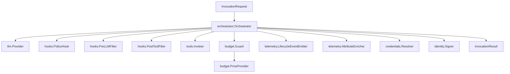

# Architecture Overview

praxis is a modular invocation kernel composed of typed Go interfaces wired together at build time. Every component is a caller-provided or default implementation of a well-defined interface, and the orchestrator is the single entry point that drives an invocation through its lifecycle.

## Component Overview

The orchestrator sits at the center of the architecture and delegates to every other subsystem through explicit interfaces. No component discovers another at runtime; all wiring is constructor injection.

Each arrow represents a direct, typed dependency. The orchestrator never reaches into a component's internals -- it calls interface methods and reacts to return values.

## Request Lifecycle

A single invocation follows a deterministic path from request to terminal state.

1. The caller constructs an `InvocationRequest` containing the model identifier, messages, tool definitions, budget limits, and optional metadata.
2. The orchestrator creates a new state machine instance in the `Created` state and transitions it through `Initializing`, where credentials are resolved and budget is initialized.
3. The `PreHook` phase fires the `PolicyHook` at the `PreInvocation` phase. If the policy denies the request, the state machine transitions directly to `Failed`.
4. The orchestrator calls the `llm.Provider` to send the request to the model. The provider abstracts away vendor-specific wire formats.
5. On receiving a response, the orchestrator enters `ToolDecision`. If the model requested tool calls, the orchestrator enters the tool-use cycle (see [State Machine - Tool-Use Cycle](/docs/core-concepts/state-machine#tool-use-cycle)). If no tool calls are present, the orchestrator moves to `PostHook`.
6. The `PostHook` phase fires the `PolicyHook` at the `PostInvocation` phase for final audit.
7. The state machine transitions to `Completed`, and the orchestrator returns an `InvocationResult` containing the final message, token usage, cost, and telemetry context.

At every boundary, the budget guard checks whether any of the four dimensions (wall-clock, tokens, tool calls, cost) have been exceeded. A breach transitions the state machine to `BudgetExceeded`.

:::tip
The state machine is the source of truth for invocation progress. See [State Machine](/docs/core-concepts/state-machine) for the full diagram and transition rules.
:::

## Design Principles

praxis is built on eight principles that inform every API decision.

1. **Typed safety via state machine.** The invocation lifecycle is a finite state machine with allow-listed transitions. Invalid transitions panic at development time rather than producing silent corruption at runtime.

2. **Provider agnosticism.** The `llm.Provider` interface decouples orchestration logic from any specific LLM vendor. Swapping from Anthropic to OpenAI changes one constructor call, not orchestration code.

3. **Policy at every boundary.** Four policy hook phases and two filter chains ensure that no data enters or leaves the system without passing through caller-defined policy evaluation.

4. **Four-dimensional budget.** Budget enforcement covers wall-clock duration, LLM token consumption, tool call count, and estimated cost in micro-dollars. All four dimensions are checked at every state transition.

5. **Observable by default.** OpenTelemetry spans are mandatory, not opt-in. A lifecycle event emitter publishes structured events for every state transition, and an attribute enricher lets callers attach domain-specific metadata.

6. **Zero-wiring start.** Every interface has a safe default implementation. `AllowAllPolicyHook`, no filters, and a zero-budget guard let you start with a single `llm.Provider` and progressively add governance.

7. **No plugins, no reflection -- build-time composition only.** Extension is by Go interface implementation compiled into the binary. There is no plugin registry, no reflection-based discovery, and no WebAssembly host.

8. **Caller-owned transport.** praxis does not serve HTTP, SSE, or WebSocket endpoints. The caller owns the transport layer and calls the orchestrator as a library.

## Package Map

Every package in praxis has a single responsibility and a stable interface boundary.

| Package | Description | API Reference |
|---------|-------------|---------------|
| `orchestrator` | Central invocation kernel; drives the state machine and coordinates all subsystems | [pkg.go.dev](https://pkg.go.dev/github.com/praxis-os/praxis/orchestrator) |
| `llm` | Provider-agnostic LLM interface, request/response types, and error taxonomy | [pkg.go.dev](https://pkg.go.dev/github.com/praxis-os/praxis/llm) |
| `llm/anthropic` | Anthropic Claude adapter implementing `llm.Provider` | [pkg.go.dev](https://pkg.go.dev/github.com/praxis-os/praxis/llm/anthropic) |
| `llm/openai` | OpenAI GPT adapter implementing `llm.Provider` (stdlib-only) | [pkg.go.dev](https://pkg.go.dev/github.com/praxis-os/praxis/llm/openai) |
| `tools` | Tool definition, registration, and invocation via `tools.Invoker` | [pkg.go.dev](https://pkg.go.dev/github.com/praxis-os/praxis/tools) |
| `hooks` | Policy hooks and filter chain interfaces (`PolicyHook`, `PreLLMFilter`, `PostToolFilter`) | [pkg.go.dev](https://pkg.go.dev/github.com/praxis-os/praxis/hooks) |
| `budget` | Four-dimensional budget enforcement (`Guard`, `PriceProvider`) | [pkg.go.dev](https://pkg.go.dev/github.com/praxis-os/praxis/budget) |
| `state` | Invocation state machine with typed states and allow-listed transitions | [pkg.go.dev](https://pkg.go.dev/github.com/praxis-os/praxis/state) |
| `telemetry` | OpenTelemetry integration, lifecycle event emitter, attribute enricher | [pkg.go.dev](https://pkg.go.dev/github.com/praxis-os/praxis/telemetry) |
| `credentials` | Credential resolution interface for injecting secrets into tool calls | [pkg.go.dev](https://pkg.go.dev/github.com/praxis-os/praxis/credentials) |
| `identity` | Per-tool-call identity assertion via `Signer` (Ed25519 JWT reference impl) | [pkg.go.dev](https://pkg.go.dev/github.com/praxis-os/praxis/identity) |

:::note
For method-level API documentation, [pkg.go.dev](https://pkg.go.dev/github.com/praxis-os/praxis) is the canonical source. These docs focus on concepts and integration patterns.
:::
