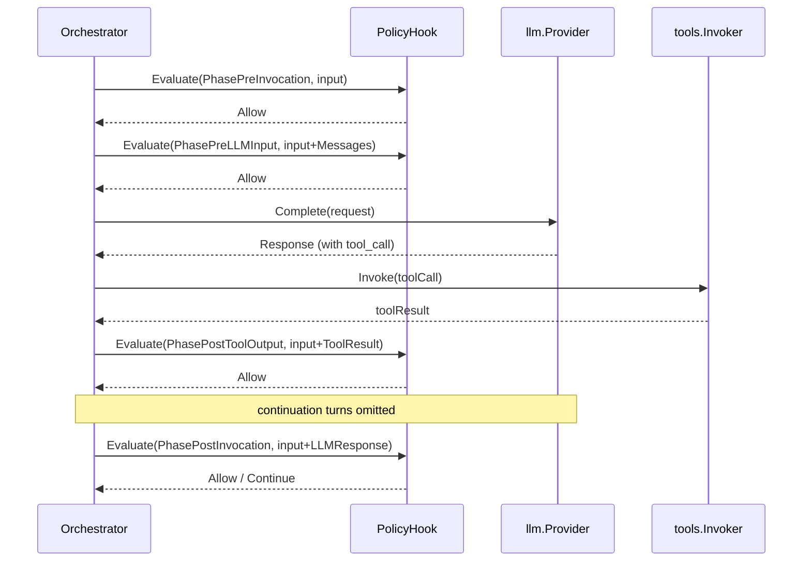

# Policy Engine

The policy engine is the subsystem that dispatches `hooks.PolicyHook.Evaluate` at defined lifecycle phases and acts on the returned `Decision`. It runs inside the orchestrator and is the integration point for every governance concern that maps to allow/deny/approve semantics: authorization, rate limiting, content policy, cost gating, audit hooks, and approval workflows.

This page covers the engine's mechanics: when it calls `Evaluate`, what `PolicyInput` carries, what each `Verdict` does, and how multiple hooks compose. For the type signatures and field lists, see the [`hooks` package API reference](../api-reference/hooks.md). For implementation walkthroughs, see [Implementing a Policy Hook](../guides/policy-hook.md). For the complementary filter chains (per-field redaction), see [Policy Hooks and Filters](./policy-hooks.md).

## The Four Phases

`PolicyHook.Evaluate` fires at four distinct points in the invocation lifecycle. A single hook instance is called at every phase; it uses the `phase` argument to branch.

| Phase | When it fires | Purpose |
|---|---|---|
| `PhasePreInvocation` | Before the first LLM call | Gate the entire invocation: caller authorization, model allow-lists, rate limits, request-level content checks |
| `PhasePreLLMInput` | Immediately before each LLM call (including continuations) | Per-turn inspection: prompt content policy, injection detection on the constructed prompt |
| `PhasePostToolOutput` | After each tool result is collected | Per-call tool-result review: audit, denial of suspicious payloads |
| `PhasePostInvocation` | After the invocation reaches a terminal state (any terminal state) | Audit logging, cost alerts, or forcing an additional LLM turn via `VerdictContinue` |



## PolicyInput: What Each Phase Sees

The same struct (`hooks.PolicyInput`) is passed at every phase. Which of its fields are populated depends on the phase — defensive access is required when reading phase-conditional fields.

| Field | `PhasePreInvocation` | `PhasePreLLMInput` | `PhasePostToolOutput` | `PhasePostInvocation` |
|---|---|---|---|---|
| `InvocationID` | ✓ | ✓ | ✓ | ✓ |
| `Model` | ✓ | ✓ | ✓ | ✓ |
| `SystemPrompt` | ✓ | ✓ | ✓ | ✓ |
| `Metadata` | ✓ | ✓ | ✓ | ✓ |
| `Messages` | *empty* (no turns yet) | ✓ (full history) | ✓ | ✓ |
| `ToolResult` | `nil` | `nil` | **✓** | `nil` |
| `LLMResponse` | `nil` | `nil` | `nil` | **✓** |

:::note
Fields not populated at a given phase are zero-valued, not "absent." `ToolResult` and `LLMResponse` are pointer types, so they are `nil` outside their populating phase — check before dereferencing.
:::

## Verdict Semantics

`Decision.Verdict` determines what the engine does next. Five verdicts are defined.

| Verdict | Engine action | State machine impact |
|---|---|---|
| `VerdictAllow` | Continue to the next step | No impact |
| `VerdictDeny` | Halt with `PolicyDeniedError`. `Reason` is mandatory and is included in the error. | Transitions to `Failed` terminal state |
| `VerdictRequireApproval` | Suspend the invocation. `Decision.Metadata` becomes the `ApprovalSnapshot` payload for the resumption packet. | Transitions to `ApprovalRequired` terminal state |
| `VerdictLog` | Continue, but emit a telemetry event recording the decision | No impact — audit trail only |
| `VerdictContinue` | At `PhasePostInvocation`: force one additional LLM turn instead of terminating. At other phases: behaves identically to `Allow`. | Overrides terminal transition at `PhasePostInvocation` |

Decisions are usually built with helpers:

```go
hooks.Allow()
hooks.Deny("reason string")
hooks.RequireApproval("reason", map[string]any{"ticket": "ABC-123"})
hooks.Log("reason")
hooks.Continue("reason")
```

## A Minimal Policy

A phase-agnostic content policy that denies forbidden words and asks for approval on sensitive ones:

```go title="examples/policy/main.go"
type contentPolicyHook struct{}

func (contentPolicyHook) Evaluate(
    _ context.Context,
    _ hooks.Phase,
    input hooks.PolicyInput,
) (hooks.Decision, error) {
    for _, msg := range input.Messages {
        for _, part := range msg.Parts {
            if part.Type != llm.PartTypeText {
                continue
            }
            lower := strings.ToLower(part.Text)
            if strings.Contains(lower, "forbidden") {
                return hooks.Deny("message contains forbidden content"), nil
            }
            if strings.Contains(lower, "sensitive") {
                return hooks.RequireApproval(
                    "message contains sensitive content",
                    map[string]any{"flagged_word": "sensitive"},
                ), nil
            }
        }
    }
    return hooks.Allow(), nil
}
```

Because `input.Messages` is empty at `PhasePreInvocation` (no turns yet), this hook effectively inspects messages at `PhasePreLLMInput`, `PhasePostToolOutput`, and `PhasePostInvocation`. A phase-aware variant would switch on `phase`.

## Phase-Aware Hooks

Real hooks typically branch on `phase` to apply different rules in different places:

```go
func (h *myHook) Evaluate(ctx context.Context, phase hooks.Phase, in hooks.PolicyInput) (hooks.Decision, error) {
    switch phase {
    case hooks.PhasePreInvocation:
        if !h.allowedModels[in.Model] {
            return hooks.Deny(fmt.Sprintf("model %q not allow-listed", in.Model)), nil
        }

    case hooks.PhasePostToolOutput:
        if in.ToolResult == nil {
            return hooks.Allow(), nil // defensive; should never happen
        }
        if in.ToolResult.Status == tools.ToolStatusError {
            return hooks.Deny("tool execution failed"), nil
        }

    case hooks.PhasePostInvocation:
        if in.LLMResponse == nil {
            return hooks.Allow(), nil
        }
        if in.LLMResponse.Usage.TotalTokens() > 100_000 {
            return hooks.Log("invocation exceeded 100k tokens"), nil
        }
    }
    return hooks.Allow(), nil
}
```

## Chaining Multiple Hooks

Multiple policy hooks register independently. The engine calls them in registration order. Short-circuit rules:

- `VerdictAllow` and `VerdictLog` continue to the next hook in the chain.
- `VerdictDeny`, `VerdictRequireApproval`, and `VerdictContinue` short-circuit the chain — subsequent hooks are not called at that phase.

```go
orch, err := orchestrator.New(provider,
    orchestrator.WithPolicyHook(authorizationHook{}),  // runs first
    orchestrator.WithPolicyHook(contentPolicyHook{}),  // runs second
    orchestrator.WithPolicyHook(auditHook{}),          // runs third
)
```

Ordering recommendation: place the most restrictive/cheapest checks first (authorization), expensive content checks second, and audit/logging hooks last. A `Deny` from the first hook avoids running the others.

## Policy vs Filter

The engine dispatches **both** policy hooks and filter chains at overlapping phases. Their roles differ:

| Need | Use |
|---|---|
| Allow/deny the entire invocation based on caller, model, or metadata | `PolicyHook` at `PhasePreInvocation` |
| Pause for human approval | `PolicyHook` returning `RequireApproval` |
| Force an additional LLM turn after apparent completion | `PolicyHook` returning `Continue` at `PhasePostInvocation` |
| Audit without affecting flow | `PolicyHook` returning `Log`, or any filter returning `FilterActionLog` |
| Redact individual fields (PII, secrets) from prompts | [`PreLLMFilter`](../api-reference/hooks.md) |
| Validate or block individual tool calls | [`PreToolFilter`](../api-reference/hooks.md) |
| Strip credentials or detect injection in tool output | [`PostToolFilter`](../api-reference/hooks.md) |

At phases where both a policy hook and a filter chain apply, the engine runs the **policy hook first**. A `Deny` from the hook short-circuits the filter chain for that phase.

## Default Behavior

When no policy hook is configured, the orchestrator installs `hooks.AllowAllPolicyHook`, which returns `Allow` at every phase. This makes the zero-wiring path explicit: policy is bypassed by choice, not by accident.

```go title="Zero-wiring start"
orch, err := orchestrator.New(provider)
// AllowAllPolicyHook is installed automatically.
```

:::tip
Add `PhasePreInvocation` hooks first; they protect the entire call without touching the rest of your configuration. Layer post-phase hooks later for audit and cost alerting.
:::

## Related

- [`hooks` package API reference](../api-reference/hooks.md) — types, interfaces, field tables
- [Policy Hooks and Filters](./policy-hooks.md) — filter chains, trust boundaries, defensive patterns
- [Implementing a Policy Hook](../guides/policy-hook.md) — step-by-step guide
- [Policy Example](../examples/policy.md) — runnable end-to-end example
