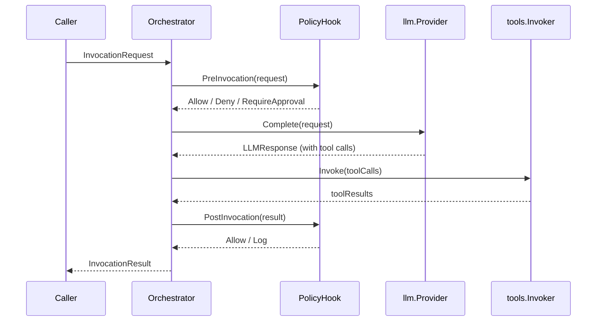

# Policy Hooks and Filters

praxis enforces caller-defined governance at every boundary where data enters or leaves the invocation kernel. The policy system has two layers: a `PolicyHook` that makes allow/deny decisions at four lifecycle phases, and two filter chains that inspect and transform data flowing through the system.

## Four-Phase Model

Policy evaluation fires at four distinct points in the invocation lifecycle. Each phase targets a specific security concern and receives phase-appropriate input.



| Phase | When it fires | What it receives | Typical use |
|-------|--------------|------------------|-------------|
| `PreInvocation` | Before the first LLM call | The full `InvocationRequest` (model, messages, tools, metadata) | Tenant authorization, request-level rate limiting, input content policy |
| `PreLLMInput` | Before each LLM call (including continuations) | The `LLMRequest` about to be sent | PII detection in prompts, system prompt injection guards |
| `PostToolOutput` | After each tool execution, before results go to the model | Tool name, input, and raw output | Sensitive data redaction, output size limits, injection detection |
| `PostInvocation` | After the invocation completes (any terminal state) | The full `InvocationResult` including final message and metrics | Audit logging, compliance recording, cost alerting |

:::note
`PreLLMInput` and `PostToolOutput` fire through the filter chain interfaces (`PreLLMFilter` and `PostToolFilter`), not through `PolicyHook`. The `PolicyHook` handles `PreInvocation` and `PostInvocation`. This separation exists because filters need fine-grained per-field control (redact, pass) while lifecycle hooks make coarse-grained decisions (allow, deny).
:::

## PolicyHook Interface

The `PolicyHook` interface evaluates invocation-level policy at the `PreInvocation` and `PostInvocation` phases.

```go title="hooks.PolicyHook interface"
type PolicyHook interface {
    Evaluate(ctx context.Context, phase Phase, input PolicyInput) (Decision, error)
}
```

`Phase` is an enum with values `PreInvocation` and `PostInvocation`. `PolicyInput` contains the phase-appropriate data (request for pre, result for post).

### Decision Verdicts

The `Decision` type carries a verdict and an optional reason string.

| Verdict | Effect | State Machine Impact |
|---------|--------|---------------------|
| `Allow` | The invocation proceeds normally | No impact -- continues to next state |
| `Deny` | The invocation is stopped immediately | Transitions to `Failed` terminal state |
| `RequireApproval` | The invocation is paused for external approval | Transitions to `ApprovalRequired` terminal state |
| `Log` | The invocation proceeds, but the decision is recorded | No impact -- event emitted via telemetry |

```go title="PolicyHook implementation example"
type ContentPolicyHook struct {
    blockedPatterns []*regexp.Regexp
}

func (h *ContentPolicyHook) Evaluate(
    ctx context.Context,
    phase hooks.Phase,
    input hooks.PolicyInput,
) (hooks.Decision, error) {
    if phase != hooks.PreInvocation {
        return hooks.Decision{Verdict: hooks.Allow}, nil
    }
    for _, msg := range input.Request.Messages {
        for _, pattern := range h.blockedPatterns {
            if pattern.MatchString(msg.Text()) {
                return hooks.Decision{
                    Verdict: hooks.Deny,
                    Reason:  "content policy violation",
                }, nil
            }
        }
    }
    return hooks.Decision{Verdict: hooks.Allow}, nil
}
```

:::warning
A `Deny` verdict at `PreInvocation` means no LLM call is ever made. This is the strongest guard against unauthorized or policy-violating requests. Use it for hard authorization checks.
:::

## Filter Chains

Filter chains provide fine-grained, per-field control over data flowing through the invocation. Unlike `PolicyHook` which makes binary allow/deny decisions, filters can selectively redact or log individual fields while allowing the invocation to continue.

### PreLLMFilter

`PreLLMFilter` runs before each LLM call, including continuation calls during the tool-use cycle. It operates on the `LLMRequest` that the orchestrator has constructed.

```go title="hooks.PreLLMFilter interface"
type PreLLMFilter interface {
    Filter(ctx context.Context, req *LLMRequest) (FilterDecision, error)
}
```

### PostToolFilter

`PostToolFilter` runs after each tool execution, before the tool output is sent back to the model. It operates on the raw tool output.

```go title="hooks.PostToolFilter interface"
type PostToolFilter interface {
    Filter(ctx context.Context, toolName string, input any, output *ToolOutput) (FilterDecision, error)
}
```

### FilterDecision Verdicts

| Verdict | Effect |
|---------|--------|
| `Pass` | Data flows through unchanged |
| `Redact` | The filter has modified the data in place (e.g., replaced PII with placeholder tokens). The invocation continues with the redacted data. |
| `Log` | Data flows through unchanged, but the filter action is recorded via the telemetry event emitter |
| `Block` | The invocation is stopped immediately. Transitions to `Failed` terminal state. |

Filters are composed as ordered chains. Each filter in the chain receives the output of the previous filter. A `Block` from any filter in the chain short-circuits the remaining filters and terminates the invocation.

```go title="Filter chain composition"
orch := orchestrator.New(
    orchestrator.WithProvider(provider),
    orchestrator.WithPreLLMFilters(
        piiDetector,      // Redacts PII tokens
        promptInjection,  // Blocks prompt injection attempts
    ),
    orchestrator.WithPostToolFilters(
        outputSanitizer,  // Redacts secrets in tool output
        sizeLimiter,      // Blocks outputs exceeding size threshold
    ),
)
```

## Trust Boundaries

The distinction between `PreLLMFilter` and `PostToolFilter` reflects a fundamental difference in trust level.

**PreLLMFilter operates on framework-controlled input.** The data passing through this filter was constructed by the orchestrator from the caller's `InvocationRequest` and any previous model responses. While the content may include user-provided text, the structure is controlled by the framework.

**PostToolFilter operates on untrusted input.** Tool output comes from external systems -- HTTP APIs, databases, file systems, or arbitrary code execution. This output has not been validated by any part of the praxis framework. It is the most security-sensitive boundary in the invocation lifecycle.

:::danger
Never skip `PostToolFilter` in production. Tool output is the primary vector for indirect prompt injection attacks, where an external system returns content designed to manipulate the model's behavior. A `PostToolFilter` that detects and redacts injection attempts is a critical security control.
:::

This trust boundary model means that `PostToolFilter` implementations should be more defensive than `PreLLMFilter` implementations. Common patterns include:

- **Output size limiting** -- Preventing tools from returning megabytes of data that consume budget and may contain hidden instructions.
- **Injection detection** -- Scanning tool output for patterns that resemble system prompt overrides or role-switching attempts.
- **Sensitive data redaction** -- Removing API keys, credentials, or PII that tools may inadvertently include in their output.

## Default Behavior

When no policy hooks or filters are configured, praxis uses safe defaults that allow all operations.

| Component | Default | Behavior |
|-----------|---------|----------|
| `PolicyHook` | `AllowAllPolicyHook` | Returns `Allow` for every phase |
| `PreLLMFilter` | None configured | No pre-LLM filtering; requests pass through unchanged |
| `PostToolFilter` | None configured | No post-tool filtering; tool output passes through unchanged |

This zero-wiring default means you can start using praxis with just an `llm.Provider` and progressively add governance as your requirements evolve. The `AllowAllPolicyHook` is explicitly named to make the security posture visible in code -- it is clear that policy is being bypassed by choice, not by accident.

```go title="Zero-wiring start (no policy)"
orch := orchestrator.New(
    orchestrator.WithProvider(provider),
    // AllowAllPolicyHook is used automatically -- no hooks or filters
)
```

:::tip
Start with `AllowAllPolicyHook` during development and add policy hooks incrementally. The four-phase model means you can add a `PreInvocation` check without touching any other part of your configuration.
:::

For the full API surface of the hooks package, see [pkg.go.dev/github.com/praxis-os/praxis/hooks](https://pkg.go.dev/github.com/praxis-os/praxis/hooks).
