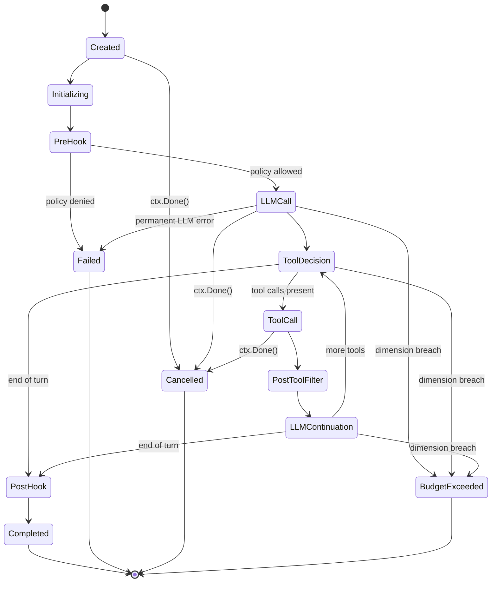
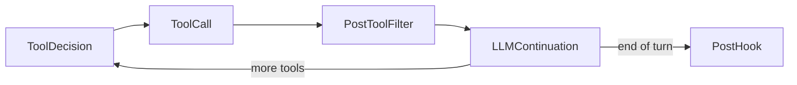

# Invocation State Machine

Every praxis invocation is governed by a typed finite state machine that enforces valid transitions at compile time and panics on illegal transitions at runtime. The state machine is the single source of truth for where an invocation is in its lifecycle.

## State Diagram

The full state machine covers nine non-terminal states and five terminal states. Every edge in this diagram is an allow-listed transition; no other transitions are permitted.



## States

The state machine has fourteen states total: nine non-terminal and five terminal.

### Non-Terminal States

| State | Description |
|-------|-------------|
| `Created` | Initial state. The invocation has been constructed but not yet started. |
| `Initializing` | Credentials are resolved, budget is initialized, and telemetry context is created. |
| `PreHook` | The `PolicyHook` evaluates the `PreInvocation` phase. A `Deny` verdict transitions to `Failed`. |
| `LLMCall` | The request is sent to the `llm.Provider`. The orchestrator awaits a response or error. |
| `ToolDecision` | The orchestrator inspects the LLM response for tool call requests. |
| `ToolCall` | One or more tool calls are executed via `tools.Invoker`. |
| `PostToolFilter` | The `PostToolFilter` chain processes tool output before it is sent back to the model. |
| `LLMContinuation` | Tool results are sent back to the model for the next turn in the tool-use cycle. |
| `PostHook` | The `PolicyHook` evaluates the `PostInvocation` phase for final audit. |

### Terminal States

| State | Description |
|-------|-------------|
| `Completed` | The invocation finished successfully with a final response. |
| `Failed` | The invocation failed due to a policy denial, permanent LLM error, or filter block. |
| `Cancelled` | The invocation was cancelled via `context.Context` cancellation. |
| `BudgetExceeded` | One or more budget dimensions were breached during execution. |
| `ApprovalRequired` | The `PolicyHook` returned a `RequireApproval` verdict, pausing the invocation for external approval. |

:::note
`ApprovalRequired` is a terminal state from the state machine's perspective. The caller is responsible for implementing the approval workflow and potentially resubmitting the invocation.
:::

## Transition Rules

The state machine enforces a strict allow-list of transitions. Only the edges shown in the state diagram above are permitted.

Attempting an unlisted transition -- for example, moving from `Created` directly to `LLMCall` -- causes a **panic**. This is intentional: illegal transitions represent programming errors in the orchestrator, not runtime conditions that should be handled gracefully.

```go title="Example: valid and invalid transitions"
// Valid: Created -> Initializing
sm.Transition(state.Initializing)

// PANIC: Created -> LLMCall is not an allow-listed transition
sm.Transition(state.LLMCall)
```

The allow-list is defined as a map of `(currentState, nextState)` pairs. Property-based tests verify that every reachable state has at least one outbound transition and that every terminal state has zero outbound transitions.

:::warning
If you see a panic with `invalid state transition`, it means the orchestrator attempted a transition that violates the state machine contract. This is always a bug in the orchestrator, not in your code.
:::

## Tool-Use Cycle

When the LLM requests tool calls, the state machine enters a cycle that repeats until the model signals end-of-turn.

1. **ToolDecision** -- The orchestrator inspects the LLM response. If tool call requests are present, it transitions to `ToolCall`.
2. **ToolCall** -- The `tools.Invoker` executes each requested tool. Tool output is raw and untrusted at this point.
3. **PostToolFilter** -- The `PostToolFilter` chain processes tool output. Filters can `Pass`, `Redact`, `Log`, or `Block` individual outputs. A `Block` verdict transitions to `Failed`.
4. **LLMContinuation** -- Filtered tool results are sent back to the model as a continuation request.
5. The model responds, and the orchestrator returns to **ToolDecision**. If the model requests more tools, the cycle repeats. If the model signals end-of-turn (a text response with no tool calls), the orchestrator transitions to **PostHook**.



The budget guard checks all four dimensions at `ToolDecision` and `LLMContinuation`. A dimension breach at any point in the cycle transitions directly to `BudgetExceeded`, breaking out of the loop.

:::tip
The tool-use cycle is unbounded by default. Use [Budget Enforcement](/docs/core-concepts/budget) to set a maximum tool call count and prevent runaway loops.
:::

## Terminal States

Each terminal state carries specific semantics that the caller should handle differently.

**Completed** -- The invocation produced a final response. The `InvocationResult` contains the model's last message, cumulative token usage, estimated cost, and telemetry span context. This is the only successful terminal state.

**Failed** -- The invocation encountered an unrecoverable error. Causes include: policy denial at `PreHook`, a `PermanentLLMError` from the provider (4xx, invalid request), or a `Block` verdict from a filter chain. The `InvocationResult` includes the error and the state at which failure occurred.

**Cancelled** -- The caller's `context.Context` was cancelled or its deadline exceeded. The invocation stopped at whatever state it was in when cancellation was detected. Partial results may be available depending on when cancellation occurred.

**BudgetExceeded** -- One or more of the four budget dimensions (wall-clock duration, tokens, tool calls, cost) was breached. The `InvocationResult` includes which dimension was exceeded and the consumed values at the time of breach. See [Budget Enforcement](/docs/core-concepts/budget) for dimension details.

**ApprovalRequired** -- The `PolicyHook` returned `RequireApproval` instead of `Allow` or `Deny`. The invocation is paused and the caller must implement an external approval workflow. The `InvocationResult` includes the approval context (which policy, what input triggered it).

## Cancellation Semantics

Cancellation is handled exclusively through Go's `context.Context` mechanism. There is no `Cancel()` method on the orchestrator or the state machine.

When `ctx.Done()` fires:

1. The state machine transitions to `Cancelled` from whichever non-terminal state it is in.
2. The orchestrator stops sending new requests to the LLM provider and stops invoking new tools.
3. In-flight LLM calls or tool calls are cancelled via the same context propagation.
4. **Terminal events are still emitted.** The orchestrator derives a background context for telemetry emission, ensuring that lifecycle event subscribers always receive a terminal event even when the original context is cancelled. This prevents silent invocation disappearances in monitoring systems.

```go title="Cancellation via context"
ctx, cancel := context.WithTimeout(context.Background(), 30*time.Second)
defer cancel()

result, err := orch.Invoke(ctx, request)
if result.TerminalState == state.Cancelled {
    // Handle cancellation -- partial results may be available
    log.Warn("invocation cancelled", "consumed_tokens", result.TokenUsage.Total)
}
```

:::warning
Do not assume that a cancelled invocation consumed zero resources. The model may have already returned tokens, and tools may have already executed side effects before cancellation was detected.
:::

For the full API surface of the state package, see [pkg.go.dev/github.com/praxis-os/praxis/state](https://pkg.go.dev/github.com/praxis-os/praxis/state).
