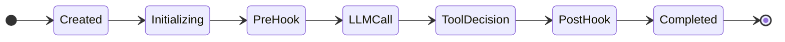

# Your First Invocation

This guide expands on the [Quick Start](/docs/getting-started/quick-start) with error handling, system messages, model selection, and a walkthrough of what the state machine does during an invocation.

## Adding a system message

System messages set the behavior and personality of the LLM. Add one as the first message in the request:

```go title="system-message.go"
req := praxis.InvocationRequest{
    Model: "claude-sonnet-4-20250514",
    Messages: []llm.Message{
        {
            Role:  llm.RoleSystem,
            Parts: []llm.MessagePart{llm.TextPart("You are a helpful geography expert. Answer concisely.")},
        },
        {
            Role:  llm.RoleUser,
            Parts: []llm.MessagePart{llm.TextPart("What is the capital of France?")},
        },
    },
}
```

## Setting the default model

Instead of specifying the model on every request, set a default when constructing the orchestrator:

```go title="default-model.go"
orch, err := orchestrator.New(provider,
    orchestrator.WithDefaultModel("claude-sonnet-4-20250514"),
)
```

Requests that specify a `Model` field override the default. Requests without a `Model` use the default.

## Error handling with TypedError

Every error returned by praxis implements `errors.TypedError`. This interface provides structured error classification for differentiated retry logic:

```go title="error-handling.go"
import praxiserrors "github.com/praxis-os/praxis/errors"

result, err := orch.Invoke(ctx, req)
if err != nil {
    var te praxiserrors.TypedError
    if errors.As(err, &te) {
        switch te.Kind() {
        case praxiserrors.TransientLLM:
            // Retryable: rate limits, 5xx, timeouts
            // praxis retries these automatically (3x with jittered backoff)
            fmt.Printf("transient error (HTTP %d): %v\n", te.HTTPStatusCode(), err)
        case praxiserrors.PermanentLLM:
            // Non-retryable: invalid request, auth failure
            fmt.Printf("permanent error: %v\n", err)
        case praxiserrors.BudgetExceeded:
            // Budget limit breached
            fmt.Printf("budget exceeded: %v\n", err)
        case praxiserrors.PolicyDenied:
            // Policy hook denied the request
            fmt.Printf("policy denied: %v\n", err)
        default:
            fmt.Printf("error (%s): %v\n", te.Kind(), err)
        }
    }
}
```

Seven error kinds drive differentiated behavior: `transient_llm`, `permanent_llm`, `tool`, `policy_denied`, `budget_exceeded`, `cancellation`, and `system`. See [Error Taxonomy](/docs/core-concepts/error-taxonomy) for the complete reference.

## Adding a context timeout

Use `context.WithTimeout` to limit the total wall-clock duration of an invocation:

```go title="context-timeout.go"
ctx, cancel := context.WithTimeout(context.Background(), 30*time.Second)
defer cancel()

result, err := orch.Invoke(ctx, req)
if err != nil {
    var te praxiserrors.TypedError
    if errors.As(err, &te) && te.Kind() == praxiserrors.Cancellation {
        fmt.Println("invocation timed out")
    }
}
```

Context cancellation transitions the state machine to the `Cancelled` terminal state. Cancelled invocations still emit their terminal lifecycle event on a derived background context, so cancellation cannot silently erase audit history.

## The state machine trace

When you call `orch.Invoke(ctx, req)`, praxis creates a fresh state machine and drives it through these states for a simple request without tool calls:



1. **Created** -- the invocation is registered with a unique ID
2. **Initializing** -- request validation, budget wall-clock starts
3. **PreHook** -- policy hooks evaluate `PreInvocation` phase; default `AllowAllPolicyHook` allows everything
4. **LLMCall** -- the request is sent to the LLM provider
5. **ToolDecision** -- the response is inspected for tool calls; none found, so we proceed
6. **PostHook** -- policy hooks evaluate `PostInvocation` phase
7. **Completed** -- terminal state; the result is returned

If the LLM had requested tool calls, the machine would enter the tool-use cycle: `ToolCall` -> `PostToolFilter` -> `LLMContinuation` -> `ToolDecision`, repeating until the LLM emits end-of-turn. See [State Machine](/docs/core-concepts/state-machine) for the full diagram.

## Next steps

- Read the [Architecture Overview](/docs/core-concepts/architecture) to understand all the components
- Learn about [Policy Hooks](/docs/core-concepts/policy-hooks) to enforce governance rules
- Add [Budget Enforcement](/docs/core-concepts/budget) to control costs
- Explore [error handling in depth](/docs/core-concepts/error-taxonomy) with the full error taxonomy
